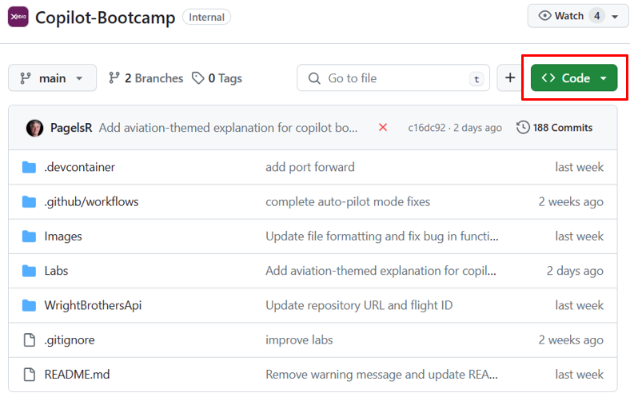
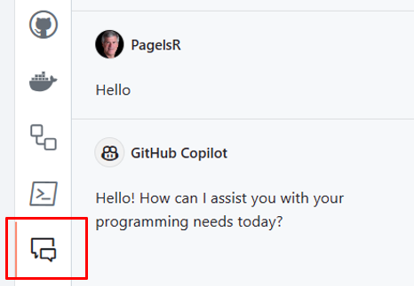

# Lab 1.1 - Pre-Flight Checklist: Setting Up GitHub Copilot and your repository

Compare this to "Preparing Your Travel Itinerary, Checking Passport, Printing Boarding Pass". Just as travelers plan their journey, participants will set up their GitHub repository, planning their coding journey. In this Hands-On Lab, you will learn how to navigate GitHub, create a new issue and obtain your own GitHub repo with the code for these hands-on labs. You will be working on your own repo in the following labs.

## Estimated time to complete

- 10 min

## Objectives

- Getting familiar with GitHub Codespace
- Set up a Codespace for your repository with specific extensions and configurations.
    - Step 1: What is a codespace?
    - Step 2: Create a codespace in your repository
    - Step 3: Verify Copilot Functionality

You can then use this codespace to work on the exercises in the Hands on Labs. 🔨

### Step 1: What is a codespace?

GitHub Codespaces is a feature that allows you to code directly in the browser. It is a cloud-hosted development environment that you can access from anywhere. It is a fully featured development environment that can be used to develop, build, and debug your applications. It is based on Visual Studio Code, so you get all the features of Visual Studio Code, including extensions, IntelliSense, and debugging.

- GitHub hosts each Codespace in a Docker container on a virtual machine, with options ranging from 2 to 32 cores, 8 to 64 GB RAM, and 32 to 128 GB storage. Codespaces default to an Ubuntu Linux image with common languages and tools, but you can customize this with any Linux distribution to meet your specific needs.

### Step 2: 💻 Create a codespace in your repository

- First, we are going to create a plain vanilla Codespace that you will use throughout this bootcamp.

 - Locate your repository by replacing `[yourhandle]` in the URL below with your GitHub handle:

    - `https://github.com/orgs/Technical-Bootcamp/repositories`.

     - For example, if your GitHub handle is `pagelsr`, the URL would be: 
`https://github.com/Technical-Bootcamp/YYY-MM-DD-Xebia-bootcamp-pagelsr`.

- Locate the `Code` tab near the top menu.
- Click the green `Code` button, then click on `Codespaces`, click the 3 ellipses, "...", and choose `"New with options"`.

- Keep the defaults, but change the machine type to `4-core` and click `Create Codespace`.

Your Codespace is being created. After a few minutes, you will be able to see your Codespace in the browser.

### Step 3: Verify Copilot Functionality

#### Hello to Copilot

- Click on the Copilot icon on the left side of the screen to open the chat.

- Type `Hello` and press `Enter` to interact with Copilot.

### Congratulations you've made it to the end! &#9992;

#### And with that, you've now concluded this module. We hope you enjoyed it! &#x1F60A;
